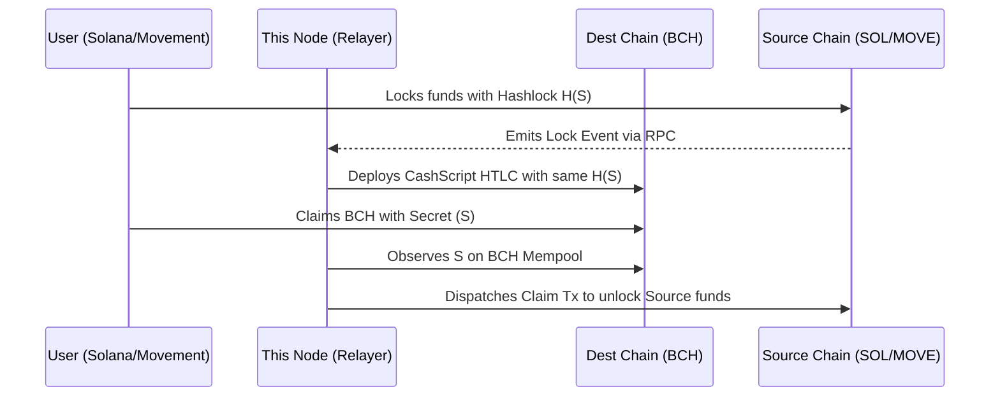

# Intents-Swaps: Cross-Chain Reference Resolver Node

[](../docs/reviewers-guide/01-protocol-overview.md)
[](#license)

This repository contains the **Node.js Reference Implementation of a Decentralized Resolver (Solver)** engine responsible for facilitating **Cross-Chain Atomic Swaps** between Bitcoin Cash and EVM/Solana/Movement architectures.

### Related Repositories
This is the off-chain engine. It actively monitors and interacts with:
* **[contracts-bch-crosschain](../contracts-bch-crosschain)**: The Bitcoin Cash Target-Chain CashScript contracts.
* **[contracts-solana](../contracts-solana)**: The Solana Target-Chain Anchor programs.
* **[contract-movement-cross-chain](../contract-movement-cross-chain)**: The Movement Target-Chain MoveVM contracts.

## Architecture

In an Intent-based protocol, the independent Decentralized Resolver is the core actor handling the heavy lifting. The user simply expresses an intent (e.g., "I will lock my Solana USDC if someone gives me Bitcoin Cash"). The Resolver monitors these intents, provides the opposite-chain liquidity, and manages the claim lifecycle.

### Execution Flow (Cross-Chain)



### Core Responsibilities
1. **Event Polling**: Continuously monitors Solana PDAs and Movement Escrow Modules for new `hashlock` commitments.
2. **Counter-Funding (Maker)**: Once a valid source lock is detected, the Resolver deploys a CashScript HTLC on Bitcoin Cash directed to the user's BCH address.
3. **Cross-Chain Synchronization (Claiming)**: When the user claims the BCH, the Resolver detects the revealed Secret (`S`) on the BCH blockchain and immediately submits a transaction to the source chain (Solana/Movement) to unlock their profit.

### Security & Review Focus
Reviewers examining this repository should focus on:
* **The Polling Engine**: Validate that the Resolver correctly parses blockchain events without race conditions, especially checking that `secret` exposures result in immediate claim dispatching.
* **Timelock Verification**: The Resolver *must* mathematically verify that the User's timelock `T` provides a sufficient buffer over the Resolver's local timelock `T/2` before committing the counter-liquidity.

---

### Navigation
* 📖 Read the detailed **[Atomic Swaps Reviewer Guide](../docs/reviewers-guide/02-cross-chain-atomic-swaps.md)** for sequence diagrams.
* 💻 Run locally: `npm run dev`

## Prerequisites
1. **Node.js**: Installed (v18+).
2. **Funds**:
   - **BCH Chipnet**: Use a faucet (e.g. `tbch.googol.cash`) to fund the wallet generated in `.env` (or let `mainnet-js` auto-generate).
   - **Solana Devnet**: Use `solana airdrop 2` to fund the Relayer's keypair.

## 1. Build Verification
The project compile errors have been resolved. To verify the build:
```bash
cd bch-solana-relayer
npm run build
# or just check types
npx tsc --noEmit
```

## 2. Verify BCH Service (Deploy HTLC)
The `scripts/deploy-htlc.ts` script initializes the BCH wallet, funds it (if needed/possible), and deploys a test HTLC.
```bash
npx tsx scripts/deploy-htlc.ts
```
**Expected Output:**
- Wallet initialization success.
- "HTLC Deployed!" with Contract Address and TxID.
- *Note: If the wallet has 0 funds, this will fail. Fund the address shown in the output.*

## 3. Verify Solana Service
The `scripts/test-solana.ts` script initializes the Solana service and attempts to create an escrow. 
```bash
npx tsx scripts/test-solana.ts
```
**Expected Output:**
- "Solana Service Initialized".
- "Caught expected error...".
- *Note: The error confirms that the code successfully built the transaction and attempted to send it, but failed due to lack of funds (expected on fresh keypair).*

## 4. Running the Relayer
To start the relayer server:
```bash
npx tsx src/index.ts
```
The server runs on port 3000 (default).
- **Health Check**: `GET http://localhost:3000/health`
- **Active Intents**: `GET http://localhost:3000/orders`

## 5. End-to-End Test (Manual)
1. **Start Relayer**: `npx tsx src/index.ts`
2. **Deploy User HTLC**: `npx tsx scripts/deploy-htlc.ts` -> Note the `hash` and `contractAddress`.
3. **Initiate Swap**: Send a POST request to `/swap/bch-to-solana` with the details from the deployment output.
4. **Monitor**: Watch the console logs for the Relayer picking up the intent, creating the Solana escrow (`DEST_LOCKED`), and completing the flow.

## Configuration
- `.env`: Contains private keys and network settings. Ensure `BCH_NETWORK=chipnet` and `SOLANA_RPC_URL=https://api.devnet.solana.com`.

---

## Future-Proofing: The 2026 STARK Upgrade

This node currently functions as a solitary hot-wallet operating standard HTLCs. To scale the network and eliminate the "Free Option Problem" for Resolvers, the 2026 Roadmap shifts this architecture to **Triton VM STARKs**. 

Future releases of the Resolver Node will:
1. Operate within a **Threshold Signature Scheme (TSS)** (e.g., a 3-of-5 MPC network) to secure the Resolver's cross-chain inventory.
2. Deposit target funds directly to the user (bypassing HTLCs).
3. Automatically compute and transmit **zk-STARK proofs** to the origin chain to instantly unlock the user's initial deposit, providing an entirely asynchronous execution environment.

---

## 📜 License

**Copyright (c) 2026 Intents-Swaps. All Rights Reserved.**
This software and associated documentation files are proprietary and confidential. No part of this repository may be copied, reproduced, distributed, or modified without explicit written permission.

*Part of the Intents Swap Protocol Ecosystem — Bringing Intent-based DeFi to Bitcoin Cash.*
